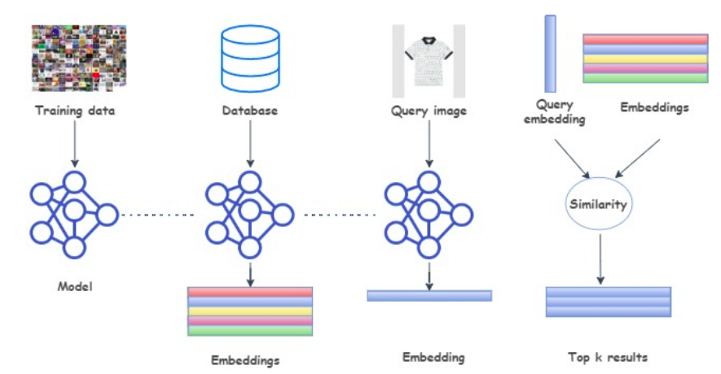
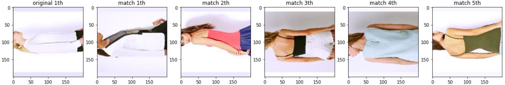
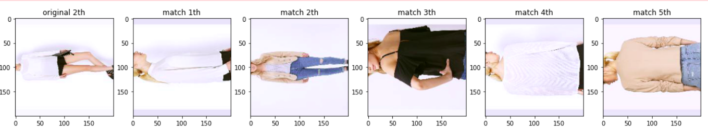
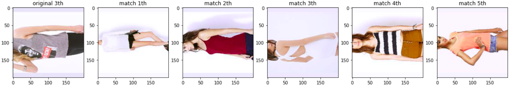

# PMLDL_Fall21IU
This repository is used to work on my assignments and homeworks in Practical Machine Learning and Deep Learning course at Innopolis University Fall 2021

## Assignment 1:

Implement a pipeline for Content-Based Image Retrieval using images embeddings based on InShop dataset, Pytorch was used to complete the assignment: [here](https://github.com/hany606/PMLDL_Fall21IU/blob/main/Assignment1/PMLDL_Assignment1.ipynb) 

Recall measurement was used in order to evaluate the model, the recall value was small (recall@10 ~= 0.25) as it was only trained for 50 epoch. In order to get higher recall value, hyperparameters must be fine-tuned and run the training for more epochs.

Results for some matchings after training based on searching for specific queries in the Database

